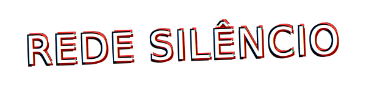

<h1 align="center">
  <br>
  <a href="#"></a>
  <br>
  <i>... a conexão foi perdida ...</i>
  <br>
</h1>

<h4 align="center">Uma plataforma de fórum assombrada, trazida diretamente de 2006 para o mundo moderno via Django.</h4>

<h5 align="center"><i>Este sistema não é seguro para minimalistas.</i></h5>

<p align="center">
  <a href="https://www.python.org/"></a>
  <a href="https://www.djangoproject.com/"></a>
  <a href="#"></a>
  <a href="#"></a>
</p>

<p align="center">
  <strong>
    <a href="#-funcionalidades-sombrias">Funcionalidades</a> •
    <a href="#-o-que-é-a-rede">Sobre</a> •
    <a href="#-ritual-de-instalação">Instalação</a> •
    <a href="#-grimório-técnico">Tecnologia</a>
  </strong>
</p>

<br>

## 🩸 O que é a Rede Silêncio?

A **Rede Silêncio** é um sistema de fórum e gerenciamento de comunidade desenvolvido com **Django** e **Django-Machina**. Diferente das redes sociais modernas, estéreis e "clean", este projeto resgata a estética caótica, gótica e "maximalista" da web dos anos 2000 (era MySpace/Fotolog/Orkut/VampireFreaks).

O objetivo é criar um ambiente imersivo para RPGs (como Ordem Paranormal), discussões de terror e ARGs (Alternate Reality Games), onde a interface faz parte da narrativa.

## 💀 Funcionalidades Sombrias

- **Interface VampireByte 2006:** Um tema CSS exclusivo, responsivo mas fiel à estética retro (fundo xadrez, fontes "sujas", cores neon e alto contraste).
- **Sistema de Fórum Completo:** Tópicos, respostas, enquetes e moderação (via Django-Machina).
- **Admin Fantasma (Ghost Protocol):** Administradores podem postar assumindo "Personas" (NPCs ou Entidades) com nomes e avatares falsos para narrar histórias sem criar múltiplas contas.
- **Autenticação Segura:** Login, Registro com validação de e-mail (SMTP real) e recuperação de senha.
- **Badges e Perfis:** Customização de perfil com estética de "cartão de identidade" e badges 88x31px.

## 🕯️ Ritual de Instalação

Siga os passos abaixo para invocar a aplicação em sua máquina local.

### Pré-requisitos
* Python 3.10 ou superior
* Git

### Passo a Passo

1. **Clone o repositório:**
   ```bash
   git clone [https://github.com/seu-usuario/rede-silencio.git](https://github.com/seu-usuario/rede-silencio.git)
   cd rede-silencio
   ```

2. **Crie o Ambiente Virtual (Venv):**
   ```bash
   python -m venv .venv
   # Windows:
   .venv\Scripts\activate
   # Linux/Mac:
   source .venv/bin/activate
   ```

3. **Instale as Dependências:**
   ```bash
   pip install -r requirements.txt
   ```

4. **Configure as Variáveis de Ambiente:**
   Crie um arquivo `.env` na raiz (baseado no `.env.example`) com suas chaves:
   ```env
   SECRET_KEY=sua_chave_secreta
   DEBUG=True
   EMAIL_HOST_USER=seu@email.com
   EMAIL_HOST_PASSWORD=sua_senha_de_app
   ```

5. **Execute as Migrações:**
   ```bash
   python manage.py migrate
   ```

6. **Inicie o Servidor:**
   ```bash
   python manage.py runserver
   ```

Acesse o portal em: `http://127.0.0.1:8000/`

## 🔮 Visualização

<table style="border: none; width: 100%;">
    <tr>
        <td align="center" style="border: none;">
            
            <br>
            <em>Tela Inicial do Fórum</em>
        </td>
        <td align="center" style="border: none;">
            
            <br>
            <em>Portal de Acesso</em>
        </td>
    </tr>
</table>

## 📜 Grimório Técnico

Ferramentas utilizadas na construção deste projeto:

<table style="border: none;">
    <tr style="border: none;">
        <td style="border: none;">
            
        </td>
        <td style="border: none;">
             
        </td>
        <td style="border: none;">
            
        </td>
    </tr>
</table>

## 🤝 Contribuição

Se você deseja adicionar mais caos a este código:

1. Faça um Fork do projeto.
2. Crie uma Branch para sua Feature (`git checkout -b feature/NovaMaldição`).
3. Faça o Commit (`git commit -m 'Adicionando rituais'`).
4. Faça o Push (`git push origin feature/NovaMaldição`).
5. Abra um Pull Request.

---

<h5 align="center">
    <i>"O silêncio é a única resposta que o abismo oferece."</i>
</h5>
